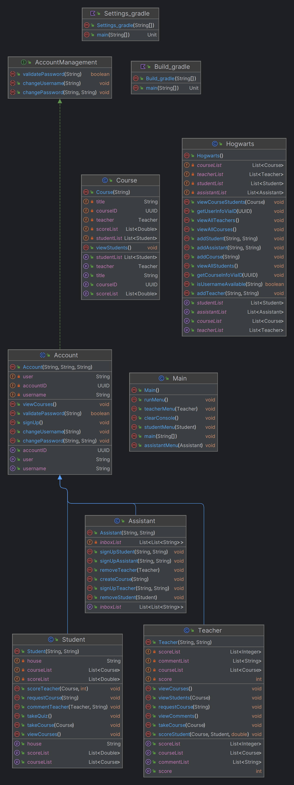

# Hogwarts

Hogwarts school system management

## Description

A terminal based management app for Hogwarts school.
As you enter the main menu of the app, you have options for your actions. any option which is desiered should be typed as written and it goes on the same with dashboards.
there's no file attached to the app, so any data added while using it will fade after closing.

Here are UML diagram of project:



## Getting Started

### Dependencies

* Windows 10 or later (Mac OS or Linux is not guaranteed)
* Apache DigestUtils 1.16.1 or later
* Java SE Runtime 8 or later

### Installing

* Download the latest release on [my github page](https://github.com/Amin-Gh-05/Hogwarts)
* There's no need to do any modification to files, but source code will not be useful. Use the .jar file in release package

### Executing program

* program should be launched using CMD
* go the directory of .jar file and type this command into commandline:
```
java -jar Hogwarts.jar
```

## Help

If you're suffering crashes or bugs, you can test other inputs or relaunching the app. In case of continuousness, contacting me and reporting is admired.

## Authors

Amin Ghoorchian

[Contact on Telegram](https://t.me/AminGh05)

## Version History

* 1.0.1
    * bug fix, errors handled and better user interface

* 1.0.0
    * First final version with not organized packaging and some common crashing


## Acknowledgments

* [SBU Mathematics and Computer Science Department](https://mathsci.sbu.ac.ir/)
* [Shayan Shahrabi (As Mentor)](https://github.com/ShayanShahrabi)
* [Oracle Documentations](https://docs.oracle.com/)
